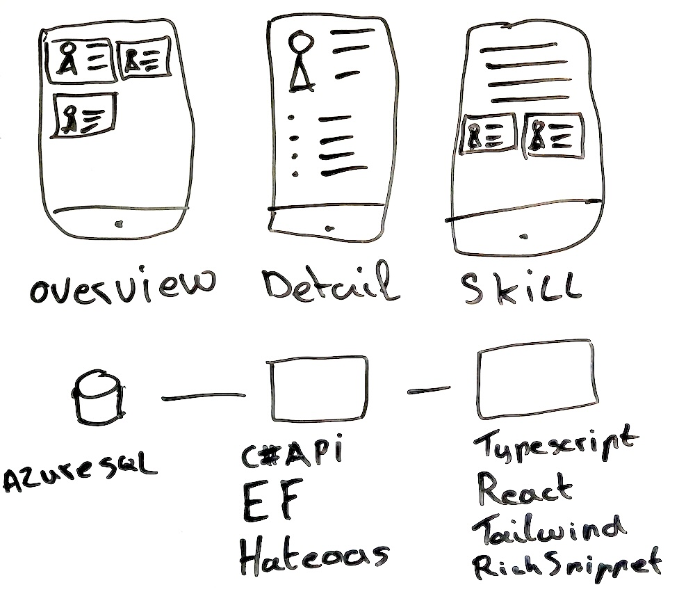

# Initial Design Whiteboard

This document captures the initial design whiteboard that was the foundation for our application architecture.

## Whiteboard Sections

The whiteboard illustrates the initial concept for the Skill Management System with:

### Interface Views
- **Overview**: A list view of people and their top skill(s)
- **Detail**: A view of a single person with their comprehensive list of skills
- **Skill**: A view showing details about a specific skill and the people who possess it

### Technology Stack
- **Database**: Azure SQL
- **Backend**: C# API, Entity Framework, and Hateoas
- **Frontend**: TypeScript, React, Tailwind, and Rich Snippet

## Design Evolution

As the project evolves, we will track how the implementation compares to this initial design vision. This document serves as a reference point for the original concept.
